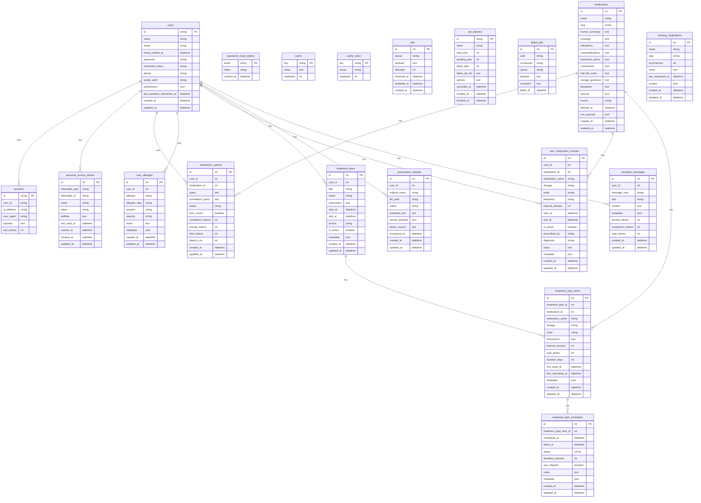

# Bulas Inteligentes

Assistente farmacêutico digital que une Laravel 12, Vue 3 + Tailwind e IA para interpretar prescrições, gerar planos de tratamento, monitorar doses e responder dúvidas de forma segura.

## Sumário

-   Visão geral
-   Principais recursos
-   Requisitos
-   Configuração rápida
-   Variáveis de ambiente
-   Modelo de dados (Mermaid)
-   Fluxos da aplicação
-   Endpoints úteis
-   Scripts de desenvolvimento
-   Suporte e notas

## Visão geral

A aplicação permite:

-   Enviar receitas (imagem/PDF) e usar Google Vision + IA para extrair medicamentos e montar um plano de doses.
-   Criar planos manualmente ou a partir de um resumo simples com ajuda da IA.
-   Registrar e acompanhar próximas doses, reagendar e marcar tomadas/puladas.
-   Conversar com o assistente de IA (token-aware) para dúvidas rápidas ou contexto clínico, sempre reforçando avaliação médica.

## Principais recursos

-   **Receitas digitalizadas**: upload com fallback de OCR; quando Google Vision está ativo, envia direto para a API e gera plano.
-   **Plano via IA**: resumo curto gera horários, intervalos e doses, evitando conflitos entre medicamentos.
-   **Dashboard**: próximos 7 dose/eventos, contadores de planos ativos, alergias e receitas pendentes.
-   **Controle de planos**: editar, arquivar/ativar e remover planos; reagendamento de doses.
-   **Assistente**: aceita perguntas gerais (como funciona) e dúvidas de medicamento, priorizando respostas curtas para economizar tokens.

## Requisitos

-   PHP 8.3+ com Composer
-   Node 18+ e npm
-   Banco configurado (MySQL/PostgreSQL/SQLite)
-   Chave OpenAI configurada
-   Chave Google Vision com billing habilitado para OCR em produção

## Configuração rápida

```bash
cp .env.example .env
composer install
npm install
php artisan key:generate
php artisan migrate
npm run build    # ou npm run dev para hot reload
php artisan serve
```

## Variáveis de ambiente

-   `OPENAI_API_KEY` / `OPENAI_DEFAULT_MODEL` / `OPENAI_TEMPERATURE`: configuram o assistente e geração de planos.
-   `GOOGLE_VISION_API_KEY`: chave da API; exige billing ativo.  
    Opcional: `GOOGLE_VISION_ENDPOINT`, `GOOGLE_VISION_FEATURE`, `GOOGLE_VISION_TIMEOUT`.
-   Banco: `DB_CONNECTION`, `DB_HOST`, `DB_PORT`, `DB_DATABASE`, `DB_USERNAME`, `DB_PASSWORD`.

## Diagrama do Banco de Dados



## Fluxos da aplicação

-   **Receitas** (`/prescriptions`):
    1. Envie imagem/PDF.
    2. Quando status for `parsed` ou `text_extracted`, informe início do tratamento e gere plano.
    3. Após gerar, a receita é removida automaticamente (arquivo + registro). Botão “Remover tentativa” apaga uploads com falha.
-   **Planos** (`/plans`):
    -   Criar manualmente ou com resumo + IA.
    -   Editar título, instruções, datas e status; remover plano.
    -   Ver agenda completa e marcar doses (tomada/pulada/reagendar).
-   **Dashboard** (`/`):
    -   Resumo com doses próximas, planos ativos, alergias e receitas pendentes.
    -   Lista “Próximas doses” usa `next_schedules` ou `schedules`.
-   **Assistente** (`/assistant`):
    -   Perguntas gerais ou sobre medicamentos. Loader de “pensando” visível. Respostas curtas para poupar tokens.

## Endpoints úteis (API)

-   Receitas:
    -   `POST /prescriptions/uploads` (multipart) — enviar receita
    -   `GET /prescriptions/uploads` — listar uploads
    -   `POST /prescriptions/uploads/{id}/plan` — gerar plano da receita (remove o upload)
    -   `DELETE /prescriptions/uploads/{id}` — remover tentativa
-   Planos:
    -   `GET /treatment-plans`, `POST /treatment-plans`
    -   `POST /treatment-plans/ai/suggest` — plano via resumo
    -   `PATCH /treatment-plans/{id}`, `DELETE /treatment-plans/{id}`
    -   `PATCH /treatment-plans/{id}/schedules/{schedule}` — registrar/reagendar dose
-   Assistente: `POST /assistant/query`

## Scripts de desenvolvimento

-   `npm run dev` — Vite em hot reload
-   `npm run build` — build de produção
-   `php artisan serve` — servidor local
-   `php artisan migrate` — migrações

## Suporte e notas

-   Se o dashboard ficar carregando, verifique as chamadas `/treatment-plans`, `/profile/medications`, `/profile/allergies`, `/prescriptions/uploads` e a validade do token (todas exigem autenticação).
-   Para OCR: mensagens de erro “billing” ou “API_KEY_SERVICE_BLOCKED” indicam que a chave Google Vision não tem cobrança/permissão. Ative billing ou troque a chave.
-   Mantenha o `OPENAI_API_KEY` válido; prompts pedem respostas curtas para reduzir custo de tokens.

## Integrantes (6SC1)

-   Dyana
-   Eve
-   Wilton
-   Yasmin Neumann
-   Yasmin Sousa
